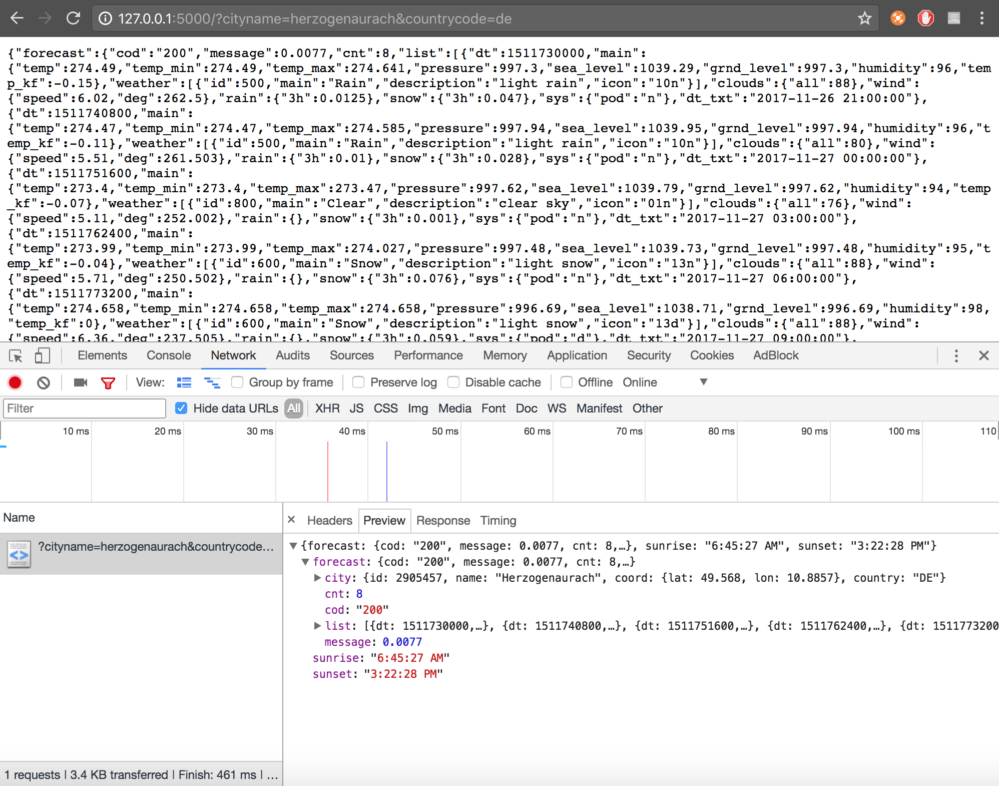
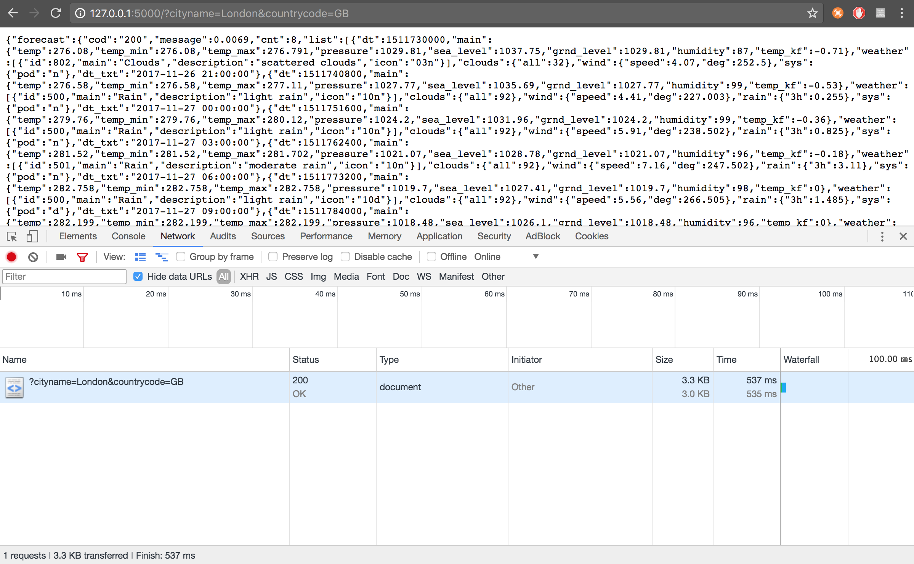
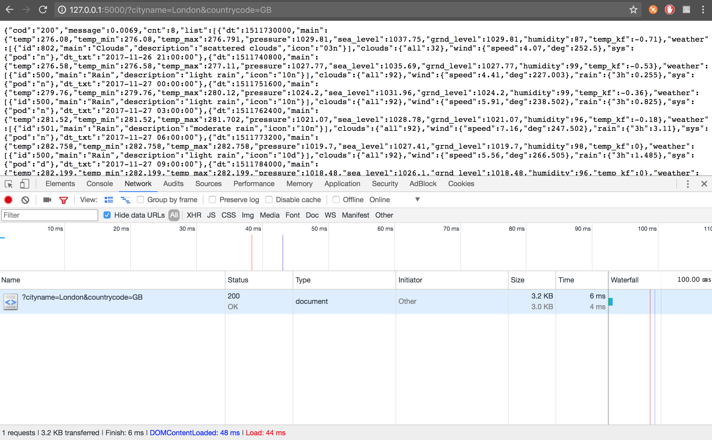
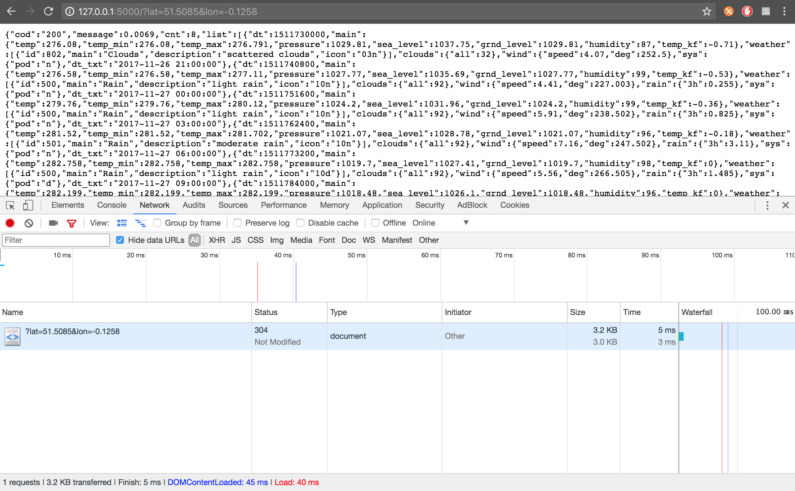

#### Adidas weather forecast API

Hello and thank you for giving me an opportunity to write this Node.js backend app as part of the interview assessment. It was both challenging and exciting to work on this take-home project. Please read instructions on how to run and what to expect from this app.

**Hosted app url:** https://frozen-dawn-22733.herokuapp.com (may take up to 20 sec to load first time, as this is deployed on Heroku with Free Subscription, next 30 minutes there should not be any delays.)

**Localhost url: ** For the best experience, install and run this app on your local machine.

----------




**NODE.js Requirements**
Before instlalling, make sure you have Node.js and npm installed on your PC/Mac, as this app is based on Node.

**Redis Requirements**
As part of the caching functionality, we use Redis. It is also essential to install Redis if you don't have it already installed:

1. Go to Redis website, download and run installation package on your machine: https://redis.io/

2. Open terminal and run ```redis-server``` to start Redis server if you did not already start it.

-----

**Install and run app**

1. Now that you have your Node and Redis installed, download all files or clone from here to the desired directory on your computer.

2. Open terminal and **cd** to the directore where you just extracted all source files. E.g. ``` cd Documents/Adidas ```

3. Install all dependencies using npm ``` npm install ```

4. Finally run the app with npm ``` npm start ```

5. That's it! Your app is run on http://127.0.0.1:5000

-----

**API Documentation**

This app is purely based on RESTful API, therefore you should expect JSON response with the request you make.

| API Route | Method | Context                                                                                                                                                                                                          | Output | Example request                                      |
|-------------------------------------------------|--------|------------------------------------------------------------------------------------------------------------------------------------------------------------------------------------------------------------------|--------|------------------------------------------------------|
| /?cityname={cityname}&countrycode={countrycode} | GET    | {cityname} - Name of the city, e.g. London{countrycode} - Country code, e.g. GB. You can find all city names and country codes using Openweathermap list: http://bulk.openweathermap.org/sample/city.list.json.gz | JSON   | https://frozen-dawn-22733.herokuapp.com?cityname=London&countrycode=GB |
| /?cityid={cityid}                               | GET    | {cityid} - Name of the city, e.g. 1526273. You can find all city ids using Openweathermap list: http://bulk.openweathermap.org/sample/city.list.json.gz                                                           | JSON   | https://frozen-dawn-22733.herokuapp.com?cityid=1526273                        |
| /?lat={latitude}&lon={longitude}                | GET    | {latitude} - Latitude, {longitude} - Longitude. You can find latitude and longitude codes using Google Maps, pointing to the desired location.                                                                     | JSON   | https://frozen-dawn-22733.herokuapp.com?lat=51.509865&lon=‎-0.118092    |

#### About this app

This is a Node.js server-based app that uses Express as the base and Redis for caching. Client makes request to get the weather forecast (forecast is every 3 hours) and receives JSON response back, including the sunset and sunrise data. When the request made for the first time (from anyone) to get weather data by city name + country code **/** city id **/** latitude and longitude data, our server makes the **Fetch** requests to the third-party APIs to gather forecast and sunset/sunrise data. **Image below** shows that for the it took **537ms** to fully complete the request and get JSON data back.



Let's wait a little time and try make this request again (ideally from another device). Now we see that we received response just within **5-6ms**. This is achieved because after initial call to third party API our app saves this response to the Redis cache and sets expiry time for this cache to **6 hours**. I believe that weather data is not updated so frequently, and caching weather data for a particular location for 6 hours is an optimal process. Also you will see extra field in JSON inside "forecast" called ```cached: true```, which means that this is cached version of response.



So why Redis and how do we store cache data? I decided to go with Redis, as it's incredibly fast when searching and returning the cached data, especially when it comes to requests from smartphones. Our app caches the data assigning the key with the format ***{cityname},{countrycode},{cityid},{lat},{lon},{forecast_json}***. Therefore, if we initially requested forecast data using e.g. only Latitude and Longitude, the next time (within 6 hours) when we request forecast data for the same country with cityname+countrycode or just cityid combination we still get our cached forecast data.



----------

The following is the **full** stack of tools and dependencies used in this project.

 - Node Express JS as the foundation
 - Redis for caching data
 - Babel and ES6 as it's a good manner to write JS in ES6 nowadays
 - Fetch for asynchronous API calling

**This is a private take-home interview coding project, it's not intended for third parties to be edited.**

Thank you and if you have any questions, please contact me on mangazbayev@gmail.com